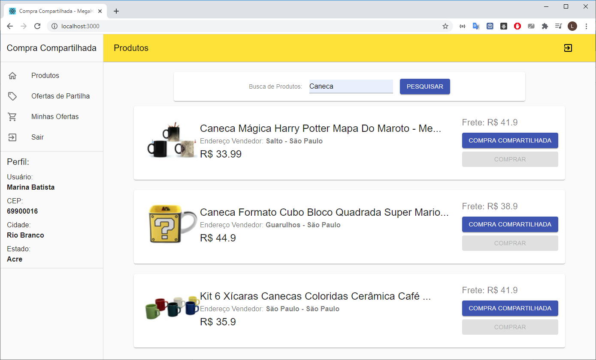
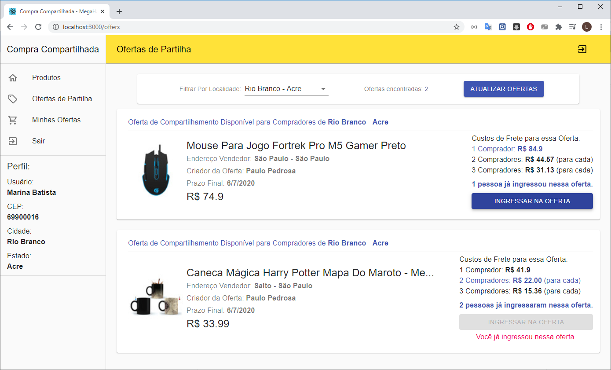
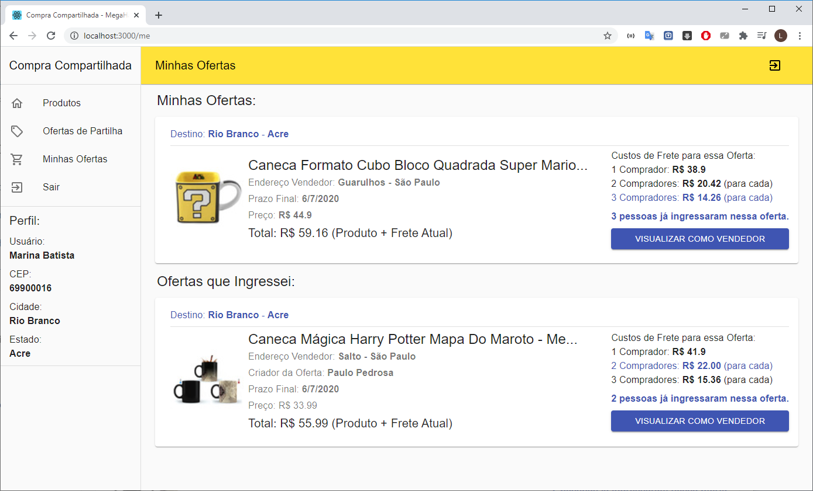

# Compra Compartilhada: Módulo para E-Commerce
O Compra Compartilhada é um projeto desenvolvido para o 3º MegaHack.<br/>O Desafio que buscamos solucionar foi o da empresa Mercado Livre.

<b>O sistema Compra Compartilha pode ser acessado em: https://compracompartilhada-fba68.web.app/</b>

A solução fornece um módulo que pode ser integrado aos sistemas de E-Commerce e traz ao usuário a possibilidade de ofertar um produto para que seu frete seja dividido entre demais compradores da mesma cidade.

Para isso, o sistema busca produtos da API do mercado livre, e realiza o cálculo de frete advindo da mesma API.

Após criar uma oferta, caso alguém de sua cidade queira comprar o mesmo produto, poderá ingressar em sua oferta e assim ambos irão dividir o valor do frete, tendo um custo de frete consideravelmente mais baixo para cada um. 

Isso permite que o fator do frete seja reduzido na hora de decidir ao realizar uma compra online.

#### Tecnologias Utilizadas

* FrontEnd: <b>ReactJs</b>
* Cloud (Back-End & Database): <b>Firebase</b>

#### Executando
O Projeto esta preparado para ser executado em Localhost, bastando baixar o projeto e inicia-lo com os comandos: ```npm install``` e ```npm start```.

Toda a estrutura de autenticação, banco de dados e back-end encontra-se na nuvem (Firebase) e é setada automaticamente.

#### Funcionalidades Implementadas:

    * Login e Registro de Usuários.
    * Visualização de Produtos (via API do Mercado Livre).
    * Calcúlo de Frete Inicial (via API do Mercado Livre).
    * Criação de Ofertas para Produtos.
    * Ingressar em Ofertas existentes.
    * Visualização de suas Ofertas e Ofertas que ingressou.
    * Visualização do Custo do Frete (individual e compartilhado).
    * Visualização da Oferta como vendedor (dados de todos os compradores).

#### Uso de API's
Todas as API's utilizadas no projeto são do Mercado Livre.
Foram utilizadas as seguintes API's:
- Busca de CEP.
- Busca de Produtos (por termo pesquisa).
- Cálculo de frete (por CEP do usuário).

## Exemplos de Interfaces do Projeto

#### Visualização de Produtos


#### Visualização de Ofertas


#### Visualização de Minhas Ofertas


---------------------------------------

#### PROBLEMA: 

Analisando grandes sites de promoções, como o PELANDO. É possível identificar rapidamente que muitas das promoções e itens vendidos na internet, não são comprados por boa parte dos internautas pelo alto custo de frete. 

Afinal o Brasil é um país de dimensões continentais e um produto, mesmo que pequeno e leve, pode custar dezenas de reais para ser entregue dependendo da localização da loja ou do comprador. 

É muito difícil encontrar alguém para dividir frete, pois exige que a pessoa seja próxima de você para ter a confiança de dividir uma compra, logo, a grande das compras é feita para apenas uma pessoa. 

-------- 

#### PERGUNTA: 

Como podemos trazer inovação para esse mercado de logística, permitindo que clientes possam realizar compras com frete barato e de forma segura e vendedores possam aumentar suas vendas pelo fator de fator do custo frete não excluir compradores? 

-------- 

#### A SOLUÇÃO: 

A solução para isso é o módulo de vendas compartilhado, que pode ser implementado ao seu E-COMMERCE e permite que pessoas possam criar lista de compras compartilhadas e encontrem pessoas próximas que estão dispostas a comprar o mesmo produto e dividir o valor do frete. 

Você encontra aquela camiseta de 50 reais com 35 de frete e acha que não vale a pena? Insira a camiseta na lista de compra compartilhada e aguarde até que outras pessoas próximas tenham o mesmo interesse e entrem na compra. 

Com duas, três ou mais pessoas, o valor do frete torna-se cada vez menor e todos podem comprar aquele produto, que até então, era inviável para qualquer um pagar o frete sozinho. 

--------- 

#### PERGUNTA #2 

Como essa solução garante que todos que fazem parte da compra irão receber o seu pedido de forma segura e cada um receber aquilo que foi comprado? Como a transportadora irá saber de quem cada é cada pedido? 

--------- 

#### RESPOSTA #2 

A criação desse sistema exige uma nova modalidade de envio, que nada mais é do que unir diferentes pedidos em um mesmo e enviá-los para um único destino, no caso uma cidade. 

Ao chegar ao destino, a pacote é aberto e dentro dele estão embalados individualmente o pedido de cada integrante da compra, com seu nome e endereço, a partir disso, trata-se de um pedido comum que será entregue na casa de cada destinatário. 

--------- 

 

#### LADO DO CLIENTE: 

A compra é gerenciada pelo módulo compartilhado, quando a compra é finalizada, cada integrante da compra tem o valor do seu produto + percentual do frete que será gerado para pagamento, sendo esse pagamento e pedido realizado dentro do E-COMMERCE, uma plataforma confiável e segura como o Mercado Livre. 

Assim que todos os integrantes finalizarem o pedido, ele estará pronto para ser preparado pelo vendedor. 

--------- 

#### LADO DO VENDEDOR: 

Ao receber uma compra compartilhada, o vendedor empacota cada parte da compra individualmente com o nome do destinatário e seu endereço. 

Após isso, o vendedor coloca todos esses pacotes dentro de uma caixa identificada como compra compartilhada, que tem por destino a cidade na qual todos esses pedidos foram feitos. 

--------- 

#### LADO DA TRANSPORTADORA: 

A transportadora irá receber o pedido compartilhado que contém uma cidade como destino principal, ao chegar na cidade, esse pedido é aberto e dentro dele existem pacotes de entrega normais com endereço e nome de cada um, assim cabe a transportadora entregar cada pedido individualmente na casa de cada comprador. 

--------- 

#### Como isso diminuiria o valor do frete? 

Sabe-se que o valor do frete em sua grande maioria é dado pelo peso e distância, porém, o e-commerce vende em sua maioria produtos leves como celulares e roupas, dessa forma, a distância acaba sendo o fator mais impactante no valor. 

Para duas ou mais pessoas da mesma cidade, o valor do frete será o mesmo, pois o valor agregado em geral está na distância entre o  

Ao se requisitar 2 ou mais unidades do mesmo produto, o valor do frete tem um acréscimo muito pequeno e ao ser dividido, na maioria dos casos torna-se menor que o frete individual. 

--------- 

#### É bom para todos? 

Com essa solução, os <b>Clientes</b> podem comprar mais e não desistirão de boas promoções por conta de frete. 

Os <b>Vendedores</b> que perdem muitas vendas pela localização de sua loja e alto custo de frete, terão mais vendas pois esse fator será reduzido drasticamente com a compra compartilhada. 

E para as <b>Transportadoras</b>, com um grande acréscimo no número de vendas, a demanda de pequenas cidades e locais onde o frete é muito caro, irá aumentar e haverá mais encomendas para serem transportadas. 